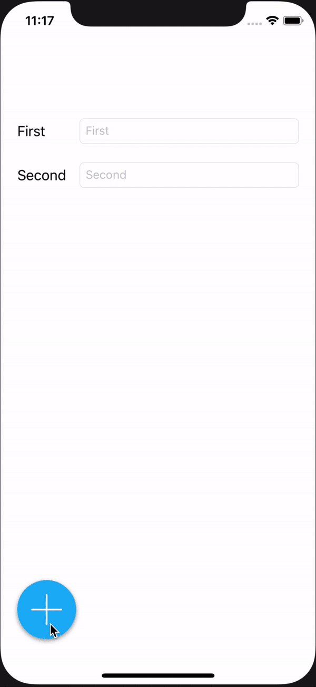

# StickyButton
A sticky floating action button for iOS.<br/>

<p align="center">
    
    
    
    
</p>

<p align="center">
    <a href="#features">Features</a>  ⦿ 
    <a href="#preview">Preview</a>  ⦿ 
    <a href="#requirements">Features</a>  ⦿ 
    <a href="#features">Requirements</a>  ⦿ 
    <a href="#installation">Installation</a>  ⦿ 
    <a href="#usage">Usage</a>  ⦿ 
    <a href="#todo">TODO</a>  ⦿ 
    <a href="#author">Author</a>
</p>

This project is inspired by the Floaty project which was inspired itself by the KCFloatingActionButton. Basically i wanted what the Floaty button does with more functionalities and flexibility.

## [Features](#features)

* ✅ Fully customizable
* ✅ Works in both Swift and Objective-C projects
* ✅ Interface builder support
* ✅ User friendly
* ✅ RLT support
* ✅ Supports swipes for side changes
* ✅ Accessibility ready and customizable
* ✅ Supports interface orientation changes
* ✅ Provides a global instance for all screens compatible with `UIWindowSceneDelegate` and iOS 13

## [Preview](#preview)

<p align="center">
    
    
    
    
</p>

## [Requirements](#requirements)

* iOS 11.0 and later
* Swift 5.0

## [Installation](#installation)

### Cocoapods

```ruby
use_frameworks!
pod 'StickyButton'
```
Then run the install command

```bash
$ pod install
```

### Manually

Just add all the content of the `StickyButton` folder in your project.

## [Usage](#usage)

### Interface builder

<p align="center">
    
    
</p>

### Global management

If you want to show the sticky button on all your app's views, you can use the global and shaed instance like below.

```swift
StickyButton.global.button.addItem(title: "Item 1", icon: UIImage(named: "icon"), handler: nil)
StickyButton.global.button.addItem(title: "Item 2", icon: UIImage(named: "icon"), handler: nil)
StickyButton.global.show()
```

If you want to hide it for some ViewControllers you can just call `StickyButton.global.hide()` in the `viewDidLoad()` method.

### Programmatically

```swift
let stickyButton = StickyButton(size: 80)
view.addSubview(stickyButton)
stickyButton.addItem(title: "Hello", icon: UIImage(named: "icon1"), handler: nil)
stickyButton.addItem(title: "Wold", icon: UIImage(named: "icon2")) { item in
    // action goes here
}
```

### Customization

You can customize the appearance of the button, the items and the expanding bakcground directly from the button. Below all the properties and their default values.

```swift
stickyButton.size = 80
stickyButton.horizontalMargin = 20
stickyButton.bottomMargin = 20
stickyButton.itemsSpacing = 8
stickyButton.buttonTintColor = .white
stickyButton.buttonBackgroundColor = UIColor(red: 31/255.0, green: 180/255.0, blue: 246/255.0, alpha: 1)

stickyButton.overlayViewBackgroundColor = UIColor.black.withAlphaComponent(0.5)

stickyButton.buttonImage = UIImage(named: "plus")
stickyButton.closeButtonImage = UIImage(named: "cross")
stickyButton.rotationDegree = 45

stickyButton.shadowRadius = 3
stickyButton.shadowOffset = CGSize(width: 0, height: 2)
stickyButton.shadowOpacity = 0.4
stickyButton.shadowColor = .black

stickyButton.autoCloseOnBackgroundTap = true
stickyButton.showMenuWhenEmpty = true
stickyButton.animateEmpty = true
stickyButton.showOnTopOfKeyboard = true

stickyButton.itemSize = 50
stickyButton.itemIconTintColor = nil
stickyButton.itemIconBackground = .white
stickyButton.itemTitleTextColor = .darkGray
stickyButton.itemTitleBackground = .white
stickyButton.itemTitleFontName = "Helvetica"
stickyButton.itemTitleFontSize = 13
stickyButton.itemTitleOffset = 20
```

## [TODO](#todo)

* [ ] Add a delegate support
* [ ] Add different animations for showing the menu
* [ ] Unit & UI test coverage

## [Author](#author)

Achref Marzouki [https://github.com/ach-ref](https://github.com/ach-ref)

## [License](#License)

`StickyButton` is available under the MIT license. See the LICENSE file for more info.